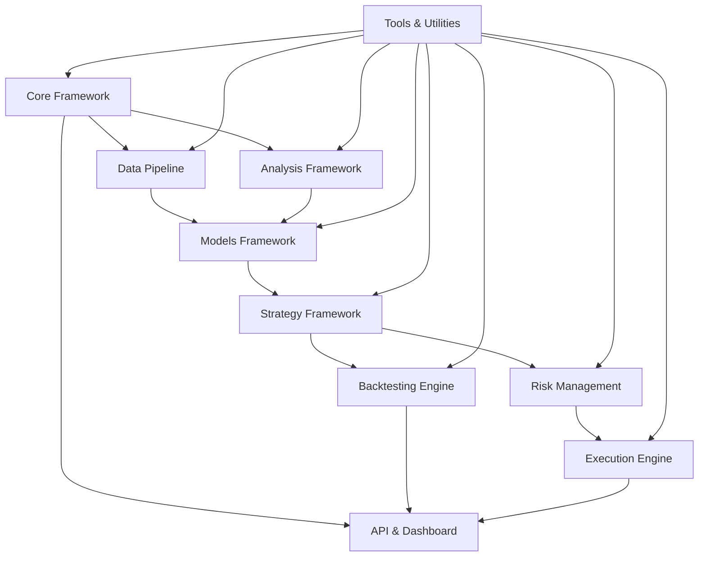

# Instinct AI System Map (v1.13)

This document provides a comprehensive overview of the Instinct AI trading system architecture, showing both the target state for v1.13 and the current implementation status. Use this as a reference for understanding system components and their relationships.

## System Architecture Overview



## Directory Structure

```
advanced_trading/
├── core/                     # Core system components
│   ├── config/               # Configuration management
│   ├── observability/        # Metrics, logging, tracing
│   └── common/               # Shared utilities
├── data/                     # All data-related components
│   ├── sources/              # Data acquisition
│   ├── processing/           # Data transformation
│   ├── storage/              # Data persistence
│   └── alternative/          # Alternative data integration
├── analysis/                 # Market and performance analysis
│   ├── market_microstructure/
│   ├── technical/            # Technical indicators
│   └── fundamental/          # Fundamental analysis
├── execution/                # Order execution
│   ├── exchange/             # Exchange connectivity
│   ├── optimization/         # Execution optimization
│   ├── safety/               # Circuit breakers & safety
│   └── monitoring/           # Execution analytics
├── strategies/               # Trading strategies
│   ├── statistical/          # Statistical strategies
│   ├── arbitrage/            # Arbitrage strategies
│   ├── ml/                   # ML-based strategies
│   └── factory/              # Strategy creation patterns
├── risk/                     # Risk management
│   ├── portfolio/            # Portfolio risk
│   ├── position/             # Position risk
│   └── market/               # Market risk
├── models/                   # ML models & frameworks
│   ├── ml_ensemble/          # Ensemble modeling
│   ├── lstm/                 # LSTM models
│   ├── transformer/          # Transformer models
│   └── volume_profile/       # Volume profile models
├── backtesting/              # Backtesting framework
│   ├── engine/               # Core backtesting engine
│   ├── analysis/             # Performance analysis
│   └── optimization/         # Strategy optimization
├── api/                      # External APIs
│   ├── rest/                 # REST API implementation
│   └── websocket/            # WebSocket API
├── dashboard/                # User interface
│   ├── views/                # Dashboard views
│   ├── components/           # Reusable UI components
│   └── services/             # Backend services for UI
└── tools/                    # Command-line tools
```

## Component Status Overview

| Component | Status | Completion % | Notes |
|-----------|--------|-------------|-------|
| Core Framework | 🟡 In Progress | 40% | Basic structures in place |
| Data Pipeline | 🟡 In Progress | 35% | Basic loaders implemented |
| Analysis Framework | 🟠 Minimal | 15% | Only basic technical indicators |
| Models Framework | 🟡 In Progress | 40% | ML Ensemble completed, others partial |
| Strategy Framework | 🟡 In Progress | 30% | Basic strategies migrated |
| Risk Management | 🟡 In Progress | 40% | Core risk framework implemented |
| Execution Engine | 🟡 In Progress | 60% | Core execution framework established |
| Backtesting Engine | 🟡 In Progress | 55% | Time series CV and Walk-forward completed |
| API Framework | 🔴 Not Started | 0% | Not yet implemented |
| Dashboard | 🟡 In Progress | 20% | Basic framework only |
| Tools & Utilities | 🟡 In Progress | 45% | Several key utilities implemented |

## Detailed Component Status

### 1. Core Framework

| Subcomponent | Status | Description |
|--------------|--------|-------------|
| Configuration | 🟡 In Progress | Dynamic config with environment overrides |
| Observability | 🟡 In Progress | Logging framework implemented, metrics partial |
| Common Utilities | 🟡 In Progress | Basic shared utilities available |
| Service Management | 🔴 Not Started | Process/service lifecycle management |
| Resource Allocation | 🔴 Not Started | System resource management |

### 2. Data Pipeline

| Subcomponent | Status | Description |
|--------------|--------|-------------|
| Market Data Sources | 🟡 In Progress | Basic exchange connectors implemented |
| Alternative Data | 🔴 Not Started | No alternative data sources integrated |
| Data Transformation | 🟡 In Progress | Basic transformations implemented |
| Feature Engineering | 🟡 In Progress | Basic feature generation available |
| Data Storage | 🟡 In Progress | Basic storage mechanisms implemented |
| Data Quality | 🔴 Not Started | Data validation not implemented |

### 3. Analysis Framework

| Subcomponent | Status | Description |
|--------------|--------|-------------|
| Market Microstructure | 🔴 Not Started | Order book analysis not implemented |
| Technical Indicators | 🟡 In Progress | Basic indicators implemented |
| Fundamental Analysis | 🔴 Not Started | No fundamental data integration |
| Sentiment Analysis | 🔴 Not Started | No sentiment data processing |
| Regime Detection | ✅ Complete | Advanced regime detection implemented |
| Event Detection | ✅ Complete | Market event detection implemented |

### 4. Models Framework

| Subcomponent | Status | Description |
|--------------|--------|-------------|
| ML Ensemble | ✅ Complete | Comprehensive ensemble framework |
| LSTM Models | 🟡 In Progress | Basic LSTM implementation available |
| Transformer Models | 🔴 Not Started | Not yet implemented |
| Volume Profile | 🟡 In Progress | Basic implementation available |
| Anomaly Detection | 🔴 Not Started | Not yet implemented |
| Feature Selection | 🟡 In Progress | Basic feature selection tools |

### 5. Strategy Framework

| Subcomponent | Status | Description |
|--------------|--------|-------------|
| Strategy Base Classes | 🟡 In Progress | Core abstract classes implemented |
| Statistical Strategies | 🟡 In Progress | Basic implementations available |
| Arbitrage Strategies | 🟡 In Progress | Fundamental implementations available |
| ML-based Strategies | 🟡 In Progress | Basic ML strategy integration |
| Strategy Factory | 🟡 In Progress | Initial implementation available |
| Strategy Lifecycle | 🟡 In Progress | Basic lifecycle management |

### 6. Risk Management

| Subcomponent | Status | Description |
|--------------|--------|-------------|
| Portfolio Risk | 🟡 In Progress | Basic portfolio risk metrics |
| Position Sizing | 🟡 In Progress | Core position sizing algorithms |
| Stop Management | 🟡 In Progress | Basic stop-loss functionality |
| Correlation Management | ✅ Complete | Advanced correlation analysis |
| VaR Calculations | 🟡 In Progress | Basic implementation available |
| Drawdown Control | 🟡 In Progress | Basic implementation available |

### 7. Execution Engine

| Subcomponent | Status | Description |
|--------------|--------|-------------|
| Exchange Connectivity | 🟡 In Progress | Multiple exchange support |
| Order Router | ✅ Complete | Smart order routing implemented |
| Execution Algorithms | ✅ Complete | TWAP, VWAP, and Adaptive implemented |
| Circuit Breakers | ✅ Complete | Multiple safety mechanisms |
| Execution Monitoring | 🟡 In Progress | Basic monitoring implemented |
| Execution Optimization | 🟡 In Progress | Basic optimizations available |

### 8. Backtesting Engine

| Subcomponent | Status | Description |
|--------------|--------|-------------|
| Time Series CV | ✅ Complete | Comprehensive time series validation |
| Walk-Forward Testing | ✅ Complete | Advanced walk-forward framework |
| Event-Driven Engine | 🟡 In Progress | Basic implementation available |
| Monte Carlo Simulations | 🔴 Not Started | Not yet implemented |
| Performance Analysis | 🟡 In Progress | Basic metrics implemented |
| Optimization Framework | 🔴 Not Started | Not yet implemented |

### 9. API Framework

| Subcomponent | Status | Description |
|--------------|--------|-------------|
| REST API | 🔴 Not Started | Not yet implemented |
| WebSocket API | 🔴 Not Started | Not yet implemented |
| Authentication | 🔴 Not Started | Not yet implemented |
| Documentation | 🔴 Not Started | Not yet implemented |

### 10. Dashboard

| Subcomponent | Status | Description |
|--------------|--------|-------------|
| System Health | 🟡 In Progress | Basic monitoring implemented |
| Strategy Control | 🟡 In Progress | Basic controls implemented |
| Performance Visualization | 🟡 In Progress | Basic visualizations available |
| Risk Monitoring | 🔴 Not Started | Not yet implemented |
| Parameter Adjustment | 🔴 Not Started | Not yet implemented |
| Alert Management | 🔴 Not Started | Not yet implemented |

### 11. Tools & Utilities

| Subcomponent | Status | Description |
|--------------|--------|-------------|
| Signal Processing | ✅ Complete | Comprehensive signal processing |
| Regime Detection | ✅ Complete | Advanced regime detection |
| Event Detection | ✅ Complete | Market event detection |
| Performance Metrics | 🟡 In Progress | Basic metrics implemented |
| Cross-Validation | ✅ Complete | Advanced time series validation |
| CLI Tools | 🔴 Not Started | Command-line interface not implemented |

## Implementation Priorities

### Immediate Priorities (Next 2 Weeks)

1. **Complete Critical Path Components**
   - Finish core execution safety mechanisms
   - Complete risk management integration
   - Finalize strategy lifecycle management

2. **Enhance Model Framework**
   - Complete LSTM model implementation
   - Integrate model persistence and versioning
   - Implement feature selection framework

3. **Improve Backtesting**
   - Complete performance analysis tools
   - Implement optimization framework
   - Add statistical significance testing

### Medium-Term Priorities (2-4 Weeks)

4. **Enhance Data Pipeline**
   - Implement more data sources
   - Improve data quality verification
   - Enhance feature engineering capabilities

5. **Dashboard Development**
   - Implement unified control center
   - Build performance monitoring
   - Create risk visualization

6. **Strategy Expansion**
   - Implement cross-venue funding arbitrage
   - Develop advanced statistical arbitrage strategies
   - Create ML-based market-making strategies

### Long-Term Priorities (4-8 Weeks)

7. **Advanced Optimizations**
   - Implement critical path optimization
   - Create alternative data integration framework
   - Develop strategy orthogonality framework

8. **API Framework**
   - Implement REST API for system control
   - Create WebSocket API for real-time data
   - Build comprehensive API documentation

9. **Advanced Analysis**
   - Implement order book intelligence
   - Develop on-chain data analytics
   - Create market microstructure analysis tools

## Cross-Component Dependencies

The system has complex dependencies between components that must be considered during implementation:

1. **Data → Models → Strategies → Execution** - The primary flow of the trading system
2. **Risk → Execution** - Risk controls direct execution behavior
3. **Backtesting → Strategies** - Strategy development relies on backtesting
4. **Core → All Components** - Core services are used by all components
5. **Models ↔ Analysis** - Bidirectional relationship for market analysis and prediction

## Detailed Cross-Component Integration Points

### ML Ensemble Integration Points

| Component | Integration Point | Status | Description |
|-----------|------------------|--------|-------------|
| Regime Detection | Feature -> Model | ✅ Complete | Regime labels feed into ensemble model training |
| Technical Indicators | Feature -> Model | ✅ Complete | Technical indicators serve as model features |
| Strategy Framework | Model -> Strategy | 🟡 In Progress | Ensemble predictions drive strategy decisions |
| Risk Management | Model -> Risk | 🟡 In Progress | Ensemble confidence affects position sizing |
| Backtesting | Model -> Backtest | ✅ Complete | Ensemble models evaluated in walk-forward testing |

### Backtesting Integration Points

| Component | Integration Point | Status | Description |
|-----------|------------------|--------|-------------|
| Data Pipeline | Data -> Backtest | ✅ Complete | Historical data feeds backtesting engine |
| Models | Model -> Backtest | ✅ Complete | Models are evaluated in backtesting engine |
| Strategies | Strategy -> Backtest | ✅ Complete | Strategies are executed in backtesting engine |
| Risk Management | Risk -> Backtest | 🟡 In Progress | Risk rules constrain backtesting execution |
| Performance Analysis | Backtest -> Analysis | 🟡 In Progress | Backtest results are analyzed for performance |

### Execution Integration Points

| Component | Integration Point | Status | Description |
|-----------|------------------|--------|-------------|
| Strategies | Strategy -> Execution | 🟡 In Progress | Strategy signals trigger execution |
| Risk Management | Risk -> Execution | 🟡 In Progress | Risk limits constrain execution |
| Safety | Safety -> Execution | ✅ Complete | Circuit breakers can halt execution |
| Monitoring | Execution -> Monitoring | 🟡 In Progress | Execution quality is monitored |
| Dashboard | Execution -> Dashboard | 🟡 In Progress | Execution status displayed in dashboard |

## Planned Future Enhancements

### Version 1.14 Planned Enhancements

1. **Advanced ML Models**
   - Transformer-based market prediction
   - Reinforcement learning for execution optimization
   - Graph neural networks for market structure analysis

2. **Alternative Data Integration**
   - News sentiment analysis pipeline
   - Social media signal processing
   - On-chain data analytics for crypto assets

3. **Advanced Execution Algorithms**
   - Reinforcement learning-based execution
   - Adaptive liquidity-seeking algorithms
   - Sophisticated anti-gaming techniques

### Version 1.15 Planned Enhancements

1. **Cross-Venue Arbitrage System**
   - Funding rate arbitrage automation
   - Latency-optimized cross-exchange execution
   - Risk-managed arbitrage portfolio

2. **Order Book Intelligence Framework**
   - Real-time order book pattern recognition
   - Flow toxicity analysis
   - Market impact prediction models

3. **Distributed Computing Framework**
   - Parallel backtesting infrastructure
   - Distributed model training
   - Redundant execution systems

## Conclusion

This system map provides a comprehensive overview of the Instinct AI v1.13 architecture and implementation status. It serves as a guide for ongoing development efforts and helps ensure all components are properly integrated. Regular updates to this document will track progress toward the complete v1.13 implementation. 